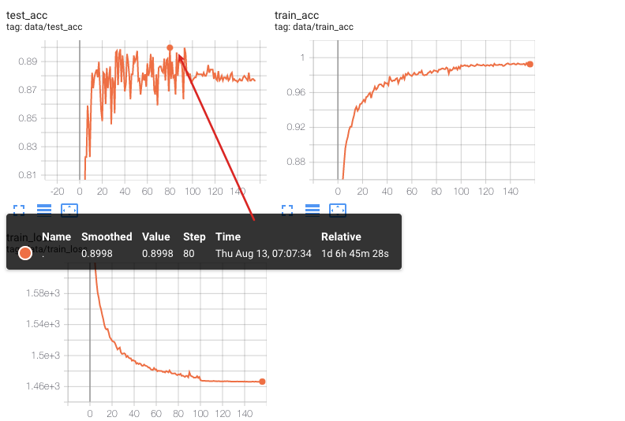

## modelnet10上进行训练

下面实验的几个前提

- modelnet10的模型都基本位于球心，但要注意modelnet40不是
- 测试100epoch

1. 学习率，使用StepLR

其他设置：SGD，NLLLoss，使用残差块

| s    | start_lr | gamma | 结果 |
| ---- | -------- | ----- | ---- |
| 100  | 1        | 0.1   |  0.8953    |
| 25   | 0.005    | 0.7   |  0.8006    |

2. 优化器

| 使用Adam | 使用SGD |
| -------- | ------- |
|     0.9019     |   0.8006       |

其他设置：学习率StepLR, s=25,l=0.005,gamma=0.7，NLLoss，使用残差块

3. 残差块

| 使用 | 不使用 |
| ---- | ------ |
|   0.8006    |  0.2742     |

其他设置：学习率StepLR, s=25,l=0.005,gamma=0.7，NLLoss，优化器SGD


## modelnet40上进行训练

| 实验名 | 数据集     | Epoch | 优化器 | 学习率策略               | testAcc |
| ------ | ---------- | ----- | ------ | ------------------------ | ------- |
| Task7  | Modelnet40 | 40    | Adam   | ds=25,gamma=0.7,lr=0.005 | 0.2522  |


## 训练观察

1. 在40个epoch几乎接近最优值
2. 使用SoftMax损失比使用LogSoftmax+NLL损失早期模型正确率更高，最终时正确率：
3. SELU比ReLU效果更好

## 超参数选取

| 参数                   | 可选1                                                        | 可选2                                   | 参考1：baseline            | 参考2：ugscnn                  |
| ---------------------- | ------------------------------------------------------------ | --------------------------------------- | -------------------------- | ------------------------------ |
| 损失函数               | <font color="pink">F.nll_loss(baseline使用的这个损失)</font> | F.softmax(+SELU在modelnet10上达到89.9%) | F.nll_loss                 | F.nll_loss                     |
| 激活函数               | **SELU**(在modelnet10上acc接近90)                            | ~~ReLU~~                                | ReLU                       | ReLU                           |
| 学习率调度             | StepLR,s=100,l=1,gamma=0.1                                   | **StepLR, s=25,l=0.005,gamma=0.7**      | StepLR,s=100,l=1,gamma=0.1 | StepLR, s=25,l=0.005,gamma=0.7 |
| 优化器选择             | Adam                                                         | SGD(momentum=0.9)                       | SGD                        | Adam                           |
| 在胶囊网络上使用残差块 | 使用：                                                       | 不使用：                                |                            |                                |

实验设计：在modelnet10上寻找超参数，训练200epoch

1. 学习率，使用StepLR

其他设置：SGD，NLLLoss，使用残差块

| s    | start_lr | gamma | 结果   |
| ---- | -------- | ----- | ------ |
| 100  | 1        | 0.1   | 0.8953 |
| 25   | 0.005    | 0.7   | 0.8006 |

2. 优化器

| 使用Adam | 使用SGD |
| -------- | ------- |
| 0.9019   | 0.8006  |

其他设置：学习率StepLR, s=25,l=0.005,gamma=0.7，NLLoss，使用残差块

3. 残差块

| 使用   | 不使用 |
| ------ | ------ |
| 0.8006 | 0.2742 |

其他设置：学习率StepLR, s=25,l=0.005,gamma=0.7，NLLoss，优化器SGD


## 时间线

### 8.11 v1.0

实现了第一版胶囊网络


### 8.15 v1.1

 - 重构了代码，在lib/models实现了三个模型。

   

### 8.16 v1.2

- Add dataset modelnet40

### 8.17 v2 [8d75bc43](https://10.22.75.213:8443/QiangZiBro/caps3d/commit/8d75bc4351500d2f17dca667e6fa6a83eaff4387)

胶囊网络参数尽可能和s2cnn保持了一致，更改体现在：

1. 输出加了log softmax


2. 卷积块定义中，SELU换成了ReLU

3. 训练时使用了NLLLoss而不是CrossEntropyLoss

   

### TODO

- [x] 使用baseline网络训练
- [x] baseline+残差块
- [x] 部分重构代码，使得更容易整合训练
- [x] 使用modelnet40 shrec15 17数据集，分别测试在三个模型上的性能

## 实验记录

### Using capsule network

```bash
# modelnet10
# without res block
python main.py  --expr_name caps_modelnet10_without_res_v1 --model_name caps --dataset_name modelnet10 --epoch 250 --batch_size 24 --is_distributed
 # with res block
python main.py  --expr_name caps_modelnet10_with_res_v1 --model_name caps --dataset_name modelnet10 --epoch 250 --batch_size 24 --is_distributed --use_residual_block

# modelnet40
# without res # untested
python main.py --expr_name caps_modelnet40 --model_name caps --dataset_name modelnet40 --epoch 250 --batch_size 4

# with res 
bad performance


# shrec15 lab213
# without res block, training...
python main.py --expr_name caps_shrec15_without_res --model_name caps --dataset_name shrec15 --epoch 250 --batch_size 12

# with res, waiting...
python main.py --expr_name caps_shrec15_with_res --model_name caps --dataset_name shrec15 --epoch 250 --batch_size 12 --use_residual_block
```


- Caps V1 在Modelnet10的表现，使用了残差块




### Baseline

```bash
# modelnet10 lab 177
python main.py --expr_name baseline_v1 --model_name baseline --is_distributed --epoch 250 --batch_size 64

# modelne40 lab 177
python main.py --expr_name baseline_modelnet40 --model_name baseline --dataset_name modelnet40 --epoch 250 --batch_size 48 --is_distributed
```


### Baseline+residual block

```bash
# modelnet10, lab 213
python main.py --expr_name resnet_v1 --model_name resnet --epoch 250 --batch_size 48

# modelnet40 lab177 
# batch_size 48，并设分布式计算可使用2个GPU约3/4的负载
python main.py --expr_name resnet_modelnet40 --model_name resnet --dataset_name modelnet40 --epoch 250 --batch_size 48 --is_distributed
```


