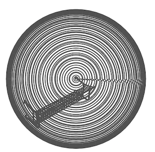
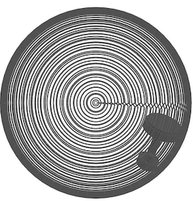
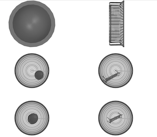
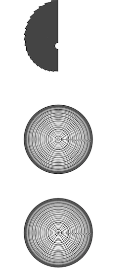

# 模型怎么处理的？

## 处理后的面片数据保存下来

使用`CacheNPY`，参数pick_randomly=True,返回的是tensor,pick_randomly=False,返回的是list，存疑

## 面片处理

原本的处理方法是进行随机平移和随机旋转。如果选择进行随机平移，则进行一次随机旋转。

```python

#随机平移（可选）
if self.tr > 0:
  tr = np.random.rand() * self.tr
  rot = rnd_rot()
  mesh.apply_transform(rot)
  mesh.apply_translation([tr, 0, 0])

  #随机旋转（若随机平移，则进行一次随机旋转；否则一次或0次随机旋转）
  if not self.rot:
    mesh.apply_transform(rot.T)

    if self.rot:
      mesh.apply_transform(rnd_rot())

      #归一化，这两行代码的功能是将离球心最远的点缩到1以内，也就是直接对所有点乘以一个系数。
      r = np.max(np.linalg.norm(mesh.vertices, axis=-1))
      mesh.apply_scale(0.99 / r)

```
但是我们发现modelnet40部分模型存在模型没有位于中心的情况：





于是我们将模型移到球心，<font color=green>改进方法</font>：

```python
# 将中心移到球心再做计算
mesh.apply_translation(-mesh.centroid)
```

这样处理之后，大多数模型被移到了球心，效果




<font color=red>但是</font>，有些模型看起来比较怪：




- 光线交叉怎么做的？

使用的api:
```python
index_tri, index_ray, loc = mesh.ray.intersects_id(
    ray_origins=sgrid, ray_directions=-sgrid, multiple_hits=False, return_locations=True)
```

Args:
- sgrid 构造的球

Returns:
- locations:返回的是光线击中mesh的位置
- index_ray:哪些光线击中了mesh
- index_tri:击中的面片序号

>还有一种类似的方式，参考这篇[教程](https://github.com/mikedh/trimesh/blob/master/examples/ray.ipynb)
>使用的api:
>
>```python
>locations, index_ray, index_tri = mesh.ray.intersects_location(
>        ray_origins=ray_origins,
>        ray_directions=ray_directions)
>```
>locations:返回的是光线击中mesh的位置
>index_ray:哪些光线击中了mesh
>index_tri:击中的面片序号
